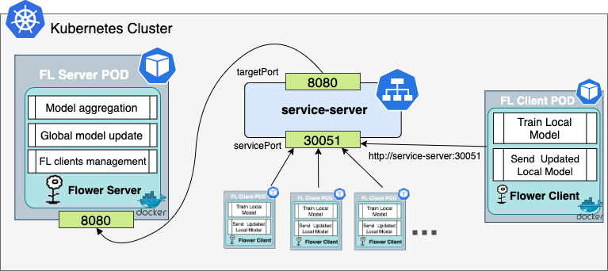

# Federated Learning for Object Detection

## Dependencies

For this proof-of-concept, a K8s cluster is deployed locally using minikube. The following packages are required and should be installed beforehand:
* [git](https://git-scm.com/)
* [docker](https://www.docker.com/)
* [minikube](https://minikube.sigs.k8s.io/docs/)

## Environment
```
pip install -r requirements.txt
```

## Dataset Preparation
### Dataset Download
Download the dataset from Kaggle [Brain Tumor Dataset](https://www.kaggle.com/datasets/pkdarabi/medical-image-dataset-brain-tumor-detection).
```
python download.py
```

### Dataset Preparation
Subset dataset to 10% and split dataset to k client for federated learning (k = 2). 
```
python subset.py
python split.py
```

## Federated learning
### Simple simulation
Open three terminal and run each command below seperatively inorder.
```
python src/server.py
```
```
python src/federated_yolo_client.py --cid 0 --server localhost --port 8080 --data ./datasets/brain-tumor-detection/BrainTumorYolov8_subset_federated/client_0/data.yaml
```
```
python src/federated_yolo_client.py --cid 1 --server localhost --port 8080 --data ./datasets/brain-tumor-detection/BrainTumorYolov8_subset_federated/client_1/data.yaml
```
### Full training
Please run below command for full training Yolo 11 model.
```
python train.py
```

### K8S Set up
 1. Deploy a K8s cluster in minikube.
 ```bash
    minikube start
 ``` 
 2. Build the docker image
 ```bash
    minikube image build -t kubeflower .
 ```

###  Step-by-step deployment
 Architecture Diagram:

 


To deploy this architecture you need to:

1. Deploy the `service-server` K8s service. From the root folder run:
    ```bash
    kubectl apply -f descriptors/serverService.yaml
    ```

2. Deploy the FL server pod through the K8s deployment. 
    ```bash
    kubectl apply -f descriptors/serverDeploy.yaml
    ```
3. Check the endpoints of service-server
    ```bash
    kubectl get endpoints service-server
    # service-server   10.244.0.4:8080   4m24s
    ```
    Modify the [clientDeploy.yaml](./descriptors/clientDeploy.yaml) so that the arg field: 
    ```bash
    CLIENT_ID=$(echo ${POD_NAME} | sed 's/.*-\([0-9]\+\)$/\1/') && \
            python src/federated_yolo_client.py --cid ${CLIENT_ID} --server 10.244.0.4 --port 8080 --data /app/datasets/BrainTumorYolov8_subset_federated/client_${CLIENT_ID}/data.yaml
        env:
    ``` 
    has the server and port match with the endpoints.
3. Deploy FL clients using the clientDeploy.yaml descriptor.  
    ```bash
    kubectl apply -f descriptors/clientDeploy.yaml
    ```
4. Monitor the training process. 
    ```bash
    kubectl get all
    ```

5. After the FL process has finished, kill the pods and services, and stop the K8s cluster on minikube.
    ```bash
    kubectl delete deploy flower-client flower-server

    kubectl delete service service-server

    minikube stop
    ```